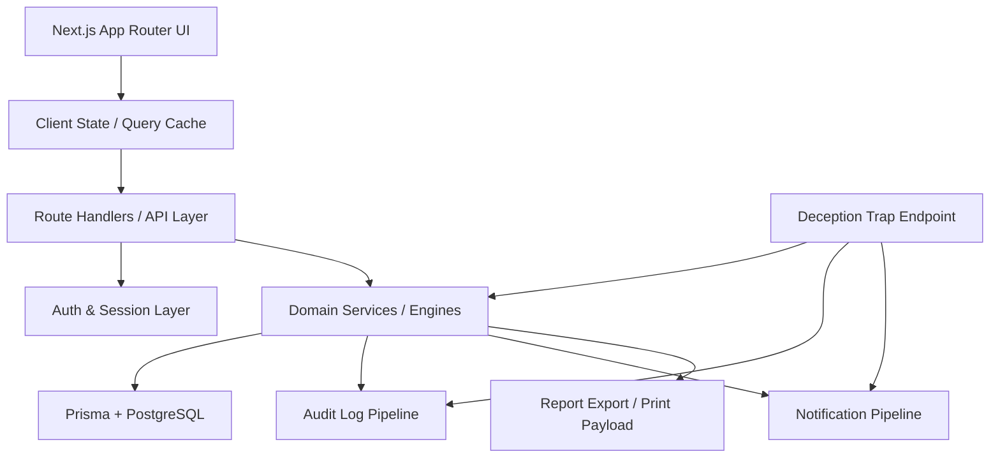

# HCSC v2 Architecture

## Mimari Hedef

HCSC v2; mevcut Next.js tabanlı frontend ürün yüzeyini koruyarak, veri ve güvenlik karar katmanını kalıcı, çok kiracılı ve API tabanlı bir altyapıya taşır.

## V1 Mimari Analizi

Mevcut v1’de:

- UI: Next.js App Router + shadcn/ui
- State: `src/store/security-console-store.ts`
- Engines:
  - `src/lib/risk-engine.ts`
  - `src/lib/zero-trust-engine.ts`
  - `src/lib/deception-engine.ts`
  - `src/lib/event-engine.ts`
  - `src/lib/compliance-engine.ts`
  - `src/lib/report-engine.ts`
- Data: `src/lib/mock-data.ts`
- Auth: mock/session tabanlı

Bu yapı demo için güçlüdür; ancak persistence, tenant isolation ve gerçek session yönetimi eksiktir.

## Hedef V2 Katmanları



## Katman Açıklamaları

## 1. Presentation Layer

Teknoloji:

- Next.js App Router
- React
- Tailwind
- shadcn/ui

Sorumluluklar:

- dashboard ve modül ekranları
- form etkileşimleri
- drawer/modal/toast
- optimistic ama kontrollü UX

Frontend iş kuralı taşımaz; kararları backend’den alır.

## 2. Client State Layer

V1’de store merkezi iş kuralı taşıyor.  
V2’de store şu role evrilir:

- UI selection state
- modal/drawer state
- filtreleme state
- query sonucu cache
- mutation loading/error state

Öneri:

- mevcut özel store korunabilir
- veya tanstack-query benzeri query cache ile hibrit kullanılabilir

## 3. API Layer

Teknoloji:

- Next.js Route Handlers

Sorumluluklar:

- auth kontrolü
- organization scope doğrulaması
- request validation
- service çağrısı
- response shaping

API route’ları iş kuralı taşımaz; service katmanını orkestre eder.

## 4. Auth & Session Layer

Sorumluluklar:

- login
- password verification
- session oluşturma
- 2FA doğrulama
- logout
- current organization context
- permission evaluation

V2 hedefi:

- gerçek session persistence
- hashed passwords
- TOTP-ready mimari

## 5. Domain Service Layer

Ana servisler:

- AssetService
- AccessRequestService
- RiskEngineService
- ZeroTrustService
- DeceptionService
- EventService
- SoarService
- ComplianceService
- ReportService
- AuditLogService
- NotificationService
- SettingsService

Bu katman v2’nin kalbidir.

## 6. Persistence Layer

Teknoloji:

- Prisma
- PostgreSQL

Sorumluluklar:

- tenant scoped veri modeli
- relational integrity
- report snapshots
- event timelines
- audit immutability yaklaşımı

## 7. Deception Trap Layer

Sorumluluklar:

- güvenli trap endpoint
- gerçek veri taşımayan lure kaynaklar
- request fingerprint toplama
- event üretme
- suspicious identity işaretleme
- önerilen SOAR aksiyonları üretme

Bu katman yalnızca savunma ve simülasyon içindir.

## 8. Audit & Notification Pipelines

Her kritik işlem:

- audit log üretir
- gerekiyorsa notification üretir

Örnek:

- login_success
- two_factor_verified
- access_request_evaluated
- deception_triggered
- playbook_executed
- report_generated

## 9. Export Layer

Sorumluluklar:

- rapor snapshot oluşturma
- print görünümü için normalize edilmiş payload
- ileride PDF render altyapısına hazır veri modeli

## Çok Kiracılı Mimari

Her domain kaydı şu scope içinde düşünülmelidir:

- `organizationId`
- gerekiyorsa `projectId` veya `workspaceId`

En düşük güvenlik kuralı:

- organization scope’u olmayan hiçbir domain kayıt sorgulanamaz.

## Authorization Model

Authorization üç seviyede değerlendirilir:

1. session valid mi?
2. user organization üyesi mi?
3. ilgili permission var mı?

Örnek:

- `view_assets`
- `evaluate_access`
- `run_playbook`
- `trigger_deception`
- `view_audit_logs`

## Service Çağrı Prensibi

Her mutation akışı şu sırayı izlemeli:

1. auth doğrulama
2. tenant scope doğrulama
3. input validation
4. domain entity load
5. engine evaluation
6. DB write
7. audit log
8. notification
9. response return

## Frontend → Backend Engine Taşıma Stratejisi

V1:

- engine fonksiyonları doğrudan browser içinde çalışıyor

V2:

- aynı fonksiyon mantığı service katmanına alınır
- frontend bu sonucu API üzerinden tüketir

Öneri:

- `src/lib/*-engine.ts` mantığı `src/server/services/engines/*` altına taşınır
- frontend kopyaları geçici süre adapter olarak kalır
- sonra sadece types/shared helpers bırakılır

## Hedef Dizin Yapısı

Öneri:

```txt
src/
  app/
    api/
      auth/
      organizations/
      assets/
      access-requests/
      events/
      deception/
      reports/
      audit-logs/
      notifications/
      settings/
  components/
  lib/
    permissions.ts
    utils.ts
  server/
    auth/
    db/
    repositories/
    services/
      engines/
      assets/
      access-requests/
      events/
      reports/
      settings/
    validators/
  store/
  types/
prisma/
```

## Neden Bu Mimari?

Bu yapı sayesinde:

- mevcut UI bozulmaz
- domain logic server-side olur
- veri kalıcı hale gelir
- tenant isolation uygulanır
- audit ve report güvenilirleşir
- deployment ve entegrasyon hazırlığı oluşur

## Mimari Riskler

1. UI ile backend aynı anda karar üretirse state drift olur.
2. Organization scope unutulursa multi-tenant güvenlik açığı oluşur.
3. Trap endpoint ile gerçek endpoint karışırsa güvenlik ve etik sınır bozulur.
4. Raporlar event snapshot yerine canlı veriyle render edilirse geçmiş görünüm tutarsızlaşır.

## Sonuç

HCSC v2 mimarisi; mevcut premium arayüzü koruyup, onun altına gerçek ürün omurgası kurmayı hedefler.  
Ana prensip: **frontend deneyimi korunurken, güvenlik kararları ve veri yaşam döngüsü backend’e taşınır.**
